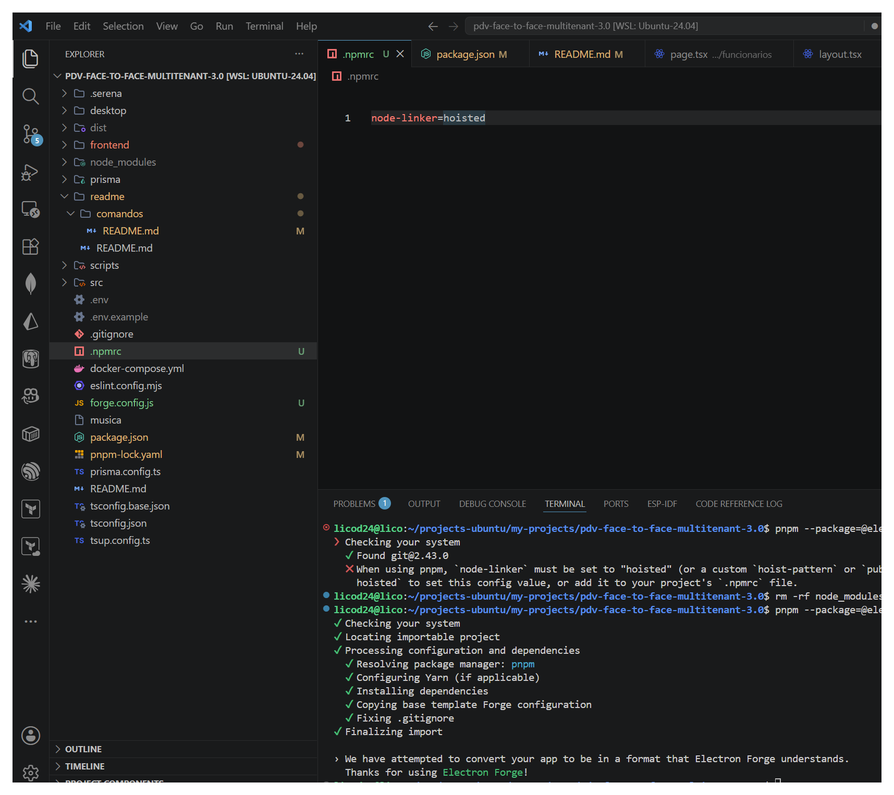
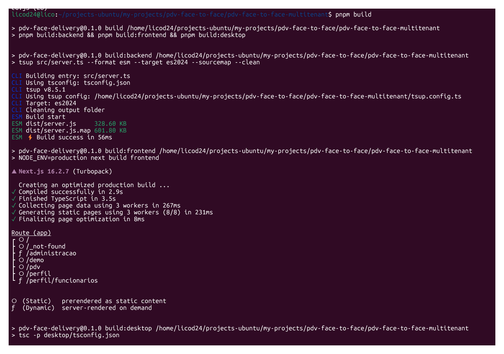
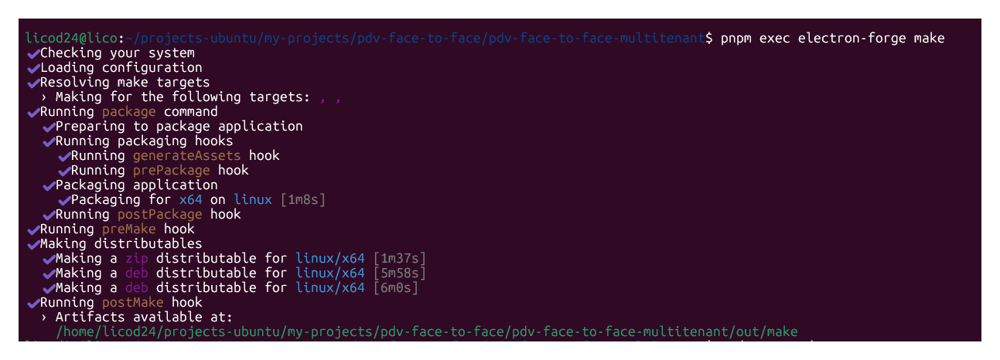
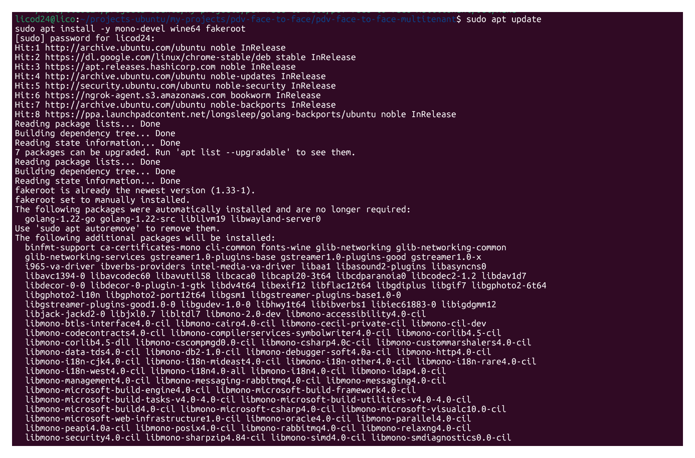
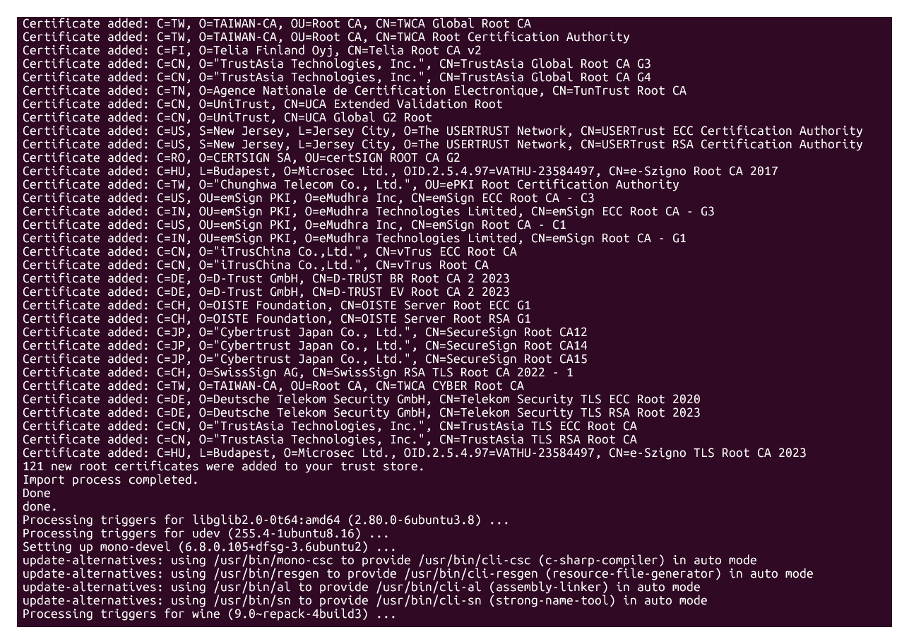
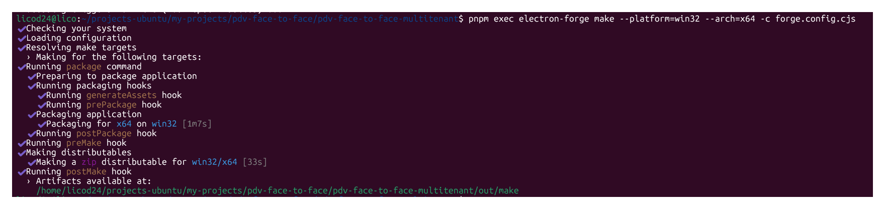

# Comandos

```sh
rm -rf node_modules
```

```sh
 npx electron -v
```

```sh
pnpm store prune
```

```sh
pnpm install && docker compose up -d && pnpm db:migrate && pnpm create-admin
```

```sh
npx prisma migrate reset --force
```

```sh
npx prisma migrate reset
```

```sh
npm list electron
```


```sh
rm -rf node_modules pnpm-lock.yaml
```

```sh
pnpm --package=@electron-forge/cli dlx --config.block-exotic-subdeps=false electron-forge import
✔ Checking your system
✔ Locating importable project
✔ Processing configuration and dependencies
  ✔ Resolving package manager: pnpm
  ✔ Configuring Yarn (if applicable)
  ✔ Installing dependencies
  ✔ Copying base template Forge configuration
  ✔ Fixing .gitignore
✔ Finalizing import

› We have attempted to convert your app to be in a format that Electron Forge understands.
  Thanks for using Electron Forge!
```



- Usando o WSL (Ubuntu), o processo para Linux gerará um pacote .deb perfeitamente compatível.

```sh
$ pnpm build
```

- Script de geração de pacotes configurado no seu projeto



```sh
$ pnpm exec electron-forge make
```


-  Electron Forge compila os binários com base no sistema em que está rodando. Para fazer uma compilação cruzada (cross-compilation) e gerar o instalador do Windows de dentro do Ubuntu/WSL, você precisa instalar as ferramentas de compatibilidade do Windows no Linux. Garanta que o compilador do Windows (Mono) está na versão atualizada no seu WSL

```sh
$ sudo apt update
sudo apt install -y mono-devel wine64 fakeroot
```


...



- O comando do Forge especificando que o alvo (target) é o Windows de 64 bits

```sh
$ pnpm exec electron-forge make --platform=win32 --arch=x64 -c forge.config.cjs
```


- Os arquivos executáveis

raiz-do-seu-projeto/out/make/pdv-face-delivery_0.1.0_amd64.deb

raiz-do-seu-projeto/out/make/squirrel.windows/x64/pdv-face-delivery-0.1.0-Setup.exe


```sh

```

```sh

```